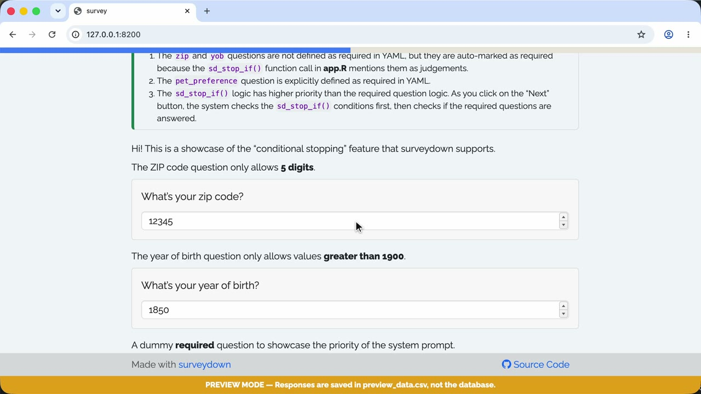

A template of conditional stopping (stop the navigation if a condition is true).

### 🟢 Demo

Try the live survey: https://surveydown-conditional-stopping.share.connect.posit.cloud

### 🎬 Walkthrough Recording

[](https://github.com/surveydown-dev/template_conditional_stopping/blob/main/video-recording.mp4)

*Click the image above to play the recording.*

### Template page

https://surveydown.org/templates/conditional_stopping

### Create this template

Run this command in your R console:

```r
surveydown::sd_create_survey(
  #path = "path/to/survey",
  template = "conditional_stopping"
)
```

### Documentation

[Conditional logic: conditional stopping](https://surveydown.org/docs/conditional-logic#conditional-stopping) · [Start with a template](https://surveydown.org/docs/getting-started#start-with-a-template)
