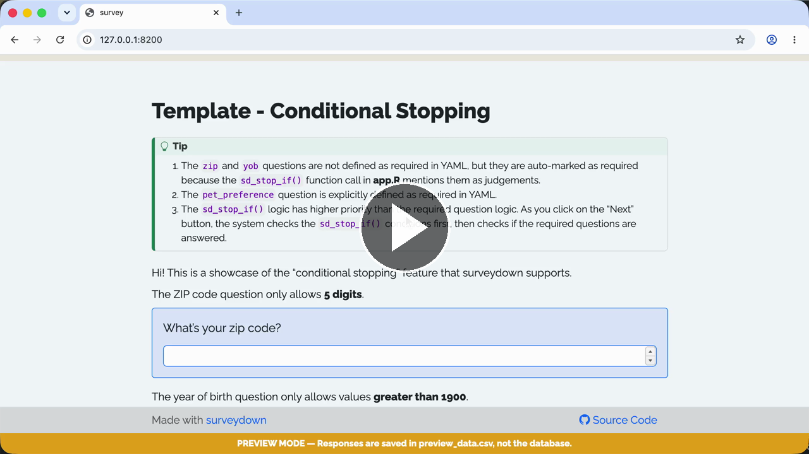

# Template - Conditional Stopping

A template of conditional stopping (stop the navigation if a condition is true).

### See it in action

Play with the [**Live demo**](https://surveydown-conditional-stopping.share.connect.posit.cloud) or watch the **Walkthrough recording:**

[](https://cdn.jsdelivr.net/gh/surveydown-dev/template_conditional_stopping@main/video-recording.mp4)

### Create this template

Run this command in your R console:

```r
surveydown::sd_create_survey(
  #path = "path/to/survey",
  template = "conditional_stopping"
)
```

### Learn more

- [Template page - Conditional Stopping](https://surveydown.org/templates/conditional_stopping)
- [Document page - Conditional logic: conditional stopping](https://surveydown.org/docs/conditional-logic#conditional-stopping)
- [Document page - Start with a template](https://surveydown.org/docs/getting-started#start-with-a-template)
